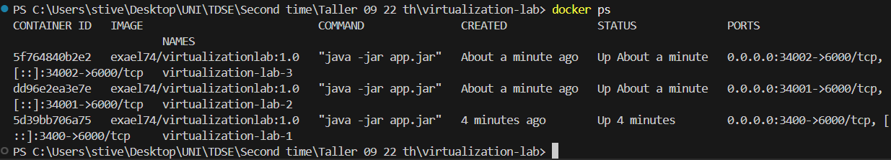
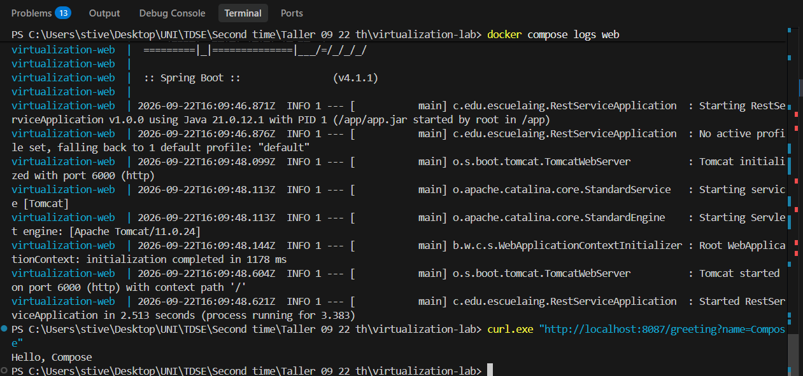

# Virtualization Lab — Containerizing and Deploying a Java Web Application

**Author:** Stiven Esneider Pardo Gutierrez
**Course:** TDSE — Software Design and Architecture
**Framework used in this repository:** Spring Boot

> ⚠️ **Scope note:** This repository contains **only** the Spring Boot implementation of the workshop (Parts 1–6). The *Assignment Extension* — a web application built with a non-Spring, custom framework supporting concurrent request handling, graceful shutdown, and environment-based configuration — is **not** part of this repository and is tracked separately.

---

## 1. Project Purpose

This project explores **virtualization as an architectural mechanism** for modularity, isolation, portability, and deployment. It builds a minimal Java web application with Spring Boot, packages it as a Docker image, runs it locally in isolated containers, publishes the image to Docker Hub, and deploys it on an Amazon EC2 virtual machine.

The workshop also requires analyzing the deployment model architecturally and estimating its infrastructure cost for different transaction volumes.

## 2. Technology Stack

| Component | Version / Detail |
|---|---|
| Language | Java 21 (LTS) |
| Build tool | Maven 3.9+ |
| Framework | Spring Boot 4.1.1 |
| Base container image | `amazoncorretto:21` |
| Containerization | Docker Desktop + Docker Compose v2 |
| Image registry | Docker Hub |
| Cloud provider | AWS EC2 — Amazon Linux 2023 |

## 3. Current Project Status

This README reflects the real, current state of the repository. Sections marked **Pending** describe work required by the workshop that has not been completed yet in this repo.

| Part | Description | Status |
|---|---|---|
| Part 1 | Web application (Maven + Spring Boot REST endpoint) | ✅ Done |
| Part 2 | Docker image build and local container execution | ✅ Done — image `exael74/virtualizationlab:1.0` built, 3 isolated containers verified with `docker ps` |
| Part 3 | Local environment with Docker Compose | ✅ Done — verified with `docker compose logs` and `curl` |
| Part 4 | Publish image to Docker Hub | ⏳ Pending |
| Part 5 | Deploy on AWS EC2 | ⏳ Pending |
| Part 6 | Deployment model and cost analysis | ⏳ Pending |
| Evidence (`evidence/`) | Screenshots, logs, pricing calculator export | 🚧 In progress — 2 screenshots added (Parts 2–3), Docker Hub/EC2/pricing/browser-port evidence still pending |
| Diagram (`docs/`) | Deployment-model diagram | ⏳ Pending — folder created, empty |
| Demonstration video | Local Docker + EC2 deployment | ⏳ Pending |

## 4. Repository Structure

```
virtualization-lab/
├── pom.xml                     # Maven build configuration (Spring Boot 4.1.1, Java 21)
├── Dockerfile                  # Container image definition (amazoncorretto:21)
├── compose.yaml                # Docker Compose service definition
├── .gitignore
├── docs/                       # Reserved for the deployment-model diagram
├── evidence/                   # Reserved for screenshots / pricing exports / logs
└── src/
    └── main/
        ├── java/co/edu/escuelaing/
        │   ├── RestServiceApplication.java   # Application entry point
        │   └── HelloRestController.java      # REST controller
        └── resources/
```

## 5. Architecture and Class Design

The application follows the standard Spring Boot layout: an entry-point class bootstraps the embedded server, and a REST controller exposes the HTTP endpoint.

```
Client (HTTP request)
   ↓
HelloRestController   → handles GET /greeting
   ↓
RestServiceApplication → bootstraps the Spring context and embedded Tomcat server
```

### `RestServiceApplication`
- Annotated with `@SpringBootApplication`, the main entry point of the app.
- Reads the listening port from the **`PORT`** environment variable via `System.getenv()`, defaulting to **`6000`** if not set. This is set as a Spring `server.port` default property, so the application never hardcodes its port — a requirement for portability across local, container, and cloud environments.

```java
package co.edu.escuelaing;

import java.util.Map;

import org.springframework.boot.SpringApplication;
import org.springframework.boot.autoconfigure.SpringBootApplication;

@SpringBootApplication
public class RestServiceApplication {
    public static void main(String[] args) {
        SpringApplication aplication = new SpringApplication(RestServiceApplication.class);

        aplication.setDefaultProperties(
            Map.of("server.port", System.getenv().getOrDefault("PORT", "6000")));

        aplication.run(args);
    }
}
```

### `HelloRestController`
- Annotated with `@RestController`.
- Exposes `GET /greeting`, accepting an optional `name` query parameter (default `"World"`).

```java
package co.edu.escuelaing;

import org.springframework.web.bind.annotation.GetMapping;
import org.springframework.web.bind.annotation.RequestParam;
import org.springframework.web.bind.annotation.RestController;

@RestController
public class HelloRestController {

    @GetMapping("/greeting")
    public String greeting(
            @RequestParam(value = "name", defaultValue = "World") String name) {
        return "Hello, " + name;
    }
}
```

## 6. Build and Run Locally

Requires Java 21 and Maven 3.9+ installed.

```bash
mvn clean package
java -jar target/*.jar
```

By default the application starts on port `6000`. To override it:

```bash
# Windows PowerShell
$env:PORT=8081; java -jar target/*.jar

# Linux / macOS
PORT=8081 java -jar target/*.jar
```

### Verify the endpoint

```
http://localhost:6000/greeting?name=Pedro
```

Expected response:

```
Hello, Pedro
```

> ⚠️ **Known gotcha — Chrome and port 6000:** Google Chrome (and Chromium-based browsers) block port `6000` by default as an "unsafe port" (`ERR_UNSAFE_PORT`), since it is historically reserved for the X11 window system. This is a **browser** restriction, not an application error — the server itself works correctly, as shown in Section 8 with `curl`. Use `curl`, Postman, or another browser (e.g., Firefox) to test port `6000` directly, or map the container/compose port to a different host port (as done in Section 8, which maps to `8087`).

## 7. Containerization with Docker

### Dockerfile

```dockerfile
FROM amazoncorretto:21

WORKDIR /app

COPY target/*.jar app.jar

EXPOSE 6000

ENTRYPOINT [ "java", "-jar", "app.jar" ]
```

### Build the image

The image is built and tagged under the Docker Hub account `exael74` (see Section 9).

```bash
mvn clean package
docker build -t exael74/virtualizationlab:1.0 .
```

### Run a container

```bash
docker run -d \
  --name virtualization-lab-1 \
  -e PORT=6000 \
  -p 34000:6000 \
  exael74/virtualizationlab:1.0
```

Verify:

```
http://localhost:34000/greeting?name=Container
```

### Demonstrating container isolation

Multiple isolated instances of the same image can run concurrently on different host ports:

```bash
docker run -d --name virtualization-lab-2 -p 34001:6000 exael74/virtualizationlab:1.0
docker run -d --name virtualization-lab-3 -p 34002:6000 exael74/virtualizationlab:1.0
```

```
http://localhost:34001/greeting?name=Container2
http://localhost:34002/greeting?name=Container3
```

> **Status: ✅ Done.** Three isolated instances of the image were built and run simultaneously, each mapped to a different host port and each responding independently:
>
> 

## 8. Local Environment with Docker Compose

`compose.yaml`:

```yaml
services:
  web:
    build: .
    container_name: virtualization-web
    environment:
      PORT: 6000
    ports:
      - "8087:6000"
```

Run it:

```bash
docker compose up -d --build
docker compose ps
docker compose logs web
```

Verify:

```
http://localhost:8087/greeting?name=Compose
```

> **Status: ✅ Done.** The Compose service was started, Spring Boot logs confirm Tomcat initialized on port 6000 inside the container, and `curl` against the mapped host port `8087` returned the expected greeting:
>
> 

## 9. Docker Hub Publication *(Pending)*

Planned steps:

```bash
docker login
docker tag exael74/virtualizationlab:1.0 exael74/virtualizationlab:latest
docker push exael74/virtualizationlab:1.0
docker push exael74/virtualizationlab:latest
```

**Docker Hub repository URL:** _TBD — to be added once the image is published._

## 10. AWS EC2 Deployment *(Pending)*

Planned steps:

1. Launch an EC2 instance using **Amazon Linux 2023**.
2. Configure the security group:
   - Allow SSH (port 22) only from the developer's public IP.
   - Allow the application port (e.g., 8080) only from the network that needs access.
3. Install Docker on the instance:
   ```bash
   sudo yum update -y
   sudo yum install -y docker
   sudo service docker start
   sudo usermod -a -G docker ec2-user
   ```
4. Pull and run the published image:
   ```bash
   docker pull exael74/virtualizationlab:1.0
   docker run -d \
     --name virtualization-lab \
     --restart unless-stopped \
     -e PORT=6000 \
     -p 8080:6000 \
     exael74/virtualizationlab:1.0
   ```
5. Verify:
   ```
   http://<ec2-public-dns>:8080/greeting?name=AWS
   ```

**Public deployment URL:** _TBD — to be added after successful EC2 deployment._

## 11. Deployment Model and Cost Analysis *(Pending)*

### Deployment model

```
Client
  ↓ HTTP request
EC2 virtual machine
  ↓
Docker Engine
  ↓
Java web application container
```

| Layer | Responsibility |
|---|---|
| EC2 virtual machine | Isolated compute, memory, storage, and network resources rented by the hour. |
| Docker container | Portable execution environment containing the application and its runtime dependencies. |
| Java web application | Receives HTTP requests and provides the business functionality. |
| Security group | Controls which inbound traffic can reach the virtual machine. |

### Workload scenarios and cost table

To be completed with AWS Pricing Calculator estimates:

| Scenario | Monthly requests | Monthly infrastructure cost | Estimated cost per request | Main cost drivers |
|---|---|---|---|---|
| Small workload | 10,000 | TBD | TBD | EC2 runtime and storage |
| Medium workload | 100,000 | TBD | TBD | EC2 runtime, storage, and network transfer |
| Large workload | 1,000,000 | TBD | TBD | Instance capacity, transfer, and scaling needs |

Architectural discussion (why EC2 has a baseline cost, when fixed cost becomes negligible per request, when to scale to multiple instances, additional production services needed, and whether serverless would suit the small-workload scenario) will be documented here once the AWS Pricing Calculator estimate is completed.

## 12. Evidence

All evidence images live under `evidence/`. Status so far:

- [ ] Local execution / browser port limitation screenshot
- [ ] Docker image build and `docker images` output
- [x] Multiple isolated containers running (`docker ps`) — `evidence/02-docker-ps-three-isolated-containers.png`
- [x] Docker Compose execution — `evidence/03-docker-compose-logs-and-curl.png`
- [ ] Docker Hub repository screenshot
- [ ] EC2 deployment screenshot / `docker ps` and `docker logs` on the instance
- [ ] AWS Pricing Calculator export (PDF/CSV)
- [ ] Deployment-model diagram (`docs/`)
- [ ] Demonstration video link

## 13. Conclusion

At this stage, the project has a working Spring Boot REST service (Part 1) that reads its port from the `PORT` environment variable, and the containerization artifacts (`Dockerfile`, `compose.yaml`) are already defined (Parts 2–3). The remaining work — building/running the image locally, publishing it to Docker Hub, deploying it on AWS EC2, and completing the cost analysis — is tracked in Sections 9–12 above and will be updated in this README as each part is completed.
