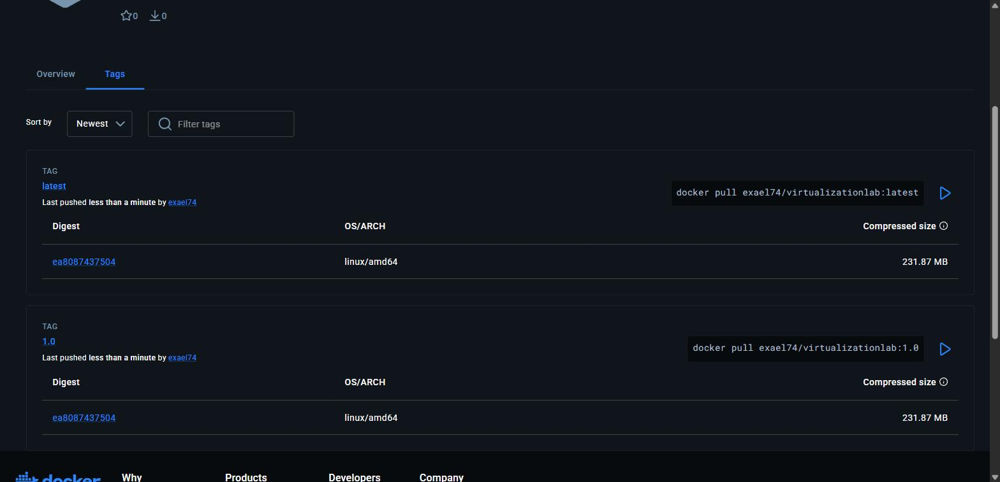
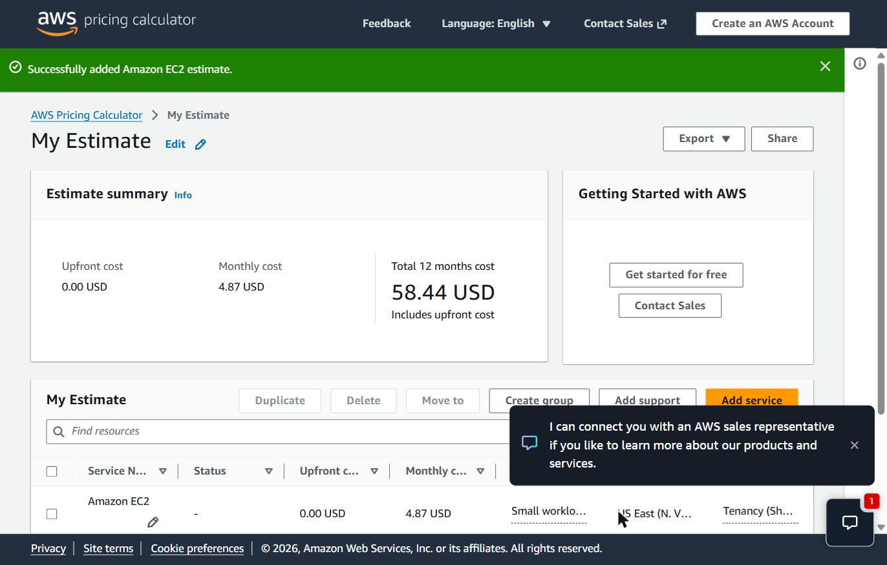

# Virtualization Lab — Containerizing and Deploying a Java Web Application

**Author:** Stiven Esneider Pardo Gutierrez
**Course:** TDSE — Transformación Digital y Sistemas Empresariales
**Framework used in this repository:** Spring Boot

> ⚠️ **Scope note:** This repository contains **only** the Spring Boot implementation of the workshop (Parts 1–6). The *Assignment Extension* — a web application built with a non-Spring, custom framework — lives in a separate repository: [Workshop-Containerizing-and-Deploying-a-Java-Web-Application-OTHER-FRAMEWORK](https://github.com/Exael74/Workshop-Containerizing-and-Deploying-a-Java-Web-Application-OTHER-FRAMEWORK).

---

## 1. Project Purpose

This project explores **virtualization as an architectural mechanism** for modularity, isolation, portability, and deployment. It builds a minimal Java web application with Spring Boot, packages it as a Docker image, runs it locally in isolated containers, publishes the image to Docker Hub, and deploys it on an Amazon EC2 virtual machine.

It also analyzes the deployment model architecturally and estimates its infrastructure cost for three transaction-volume scenarios using the AWS Pricing Calculator.

## 2. Technology Stack

| Component | Version / Detail |
|---|---|
| Language | Java 21 (LTS) |
| Build tool | Maven 3.9+ |
| Framework | Spring Boot 4.1.1 |
| Base container image | `amazoncorretto:21` |
| Containerization | Docker Desktop + Docker Compose v2 |
| Database (Part 3 only) | MongoDB 8 (`mongo:8`) |
| Image registry | Docker Hub — [`exael74/virtualizationlab`](https://hub.docker.com/r/exael74/virtualizationlab) |
| Cloud provider | AWS EC2 — Amazon Linux 2023, `t2.micro`, `us-east-1` |

## 3. Project Status

| Part | Description | Status |
|---|---|---|
| Part 1 | Web application (Maven + Spring Boot REST endpoint) | ✅ Done |
| Part 2 | Docker image build, local run, container isolation | ✅ Done |
| Part 3 | Multi-container environment with Docker Compose + MongoDB | ✅ Done |
| Part 4 | Publish image to Docker Hub | ✅ Done |
| Part 5 | Deploy on AWS EC2 | ✅ Done — publicly reachable |
| Part 6 | Deployment model and cost analysis | ✅ Done |
| Evidence (`evidence/`) | Screenshots and command-output logs | ✅ Done |
| Diagram (`docs/`) | Deployment-model diagram | ✅ Included in Section 11 |
| Demonstration video | Local Docker + EC2 deployment | ⏳ Pending (to be recorded and linked here) |

**Docker Hub repository:** https://hub.docker.com/r/exael74/virtualizationlab
**Public deployment URL:** http://54.175.21.62:8080/greeting?name=AWS

## 4. Repository Structure

```
virtualization-lab/
├── pom.xml                     # Maven build configuration (Spring Boot 4.1.1, Java 21)
├── Dockerfile                  # Container image definition (amazoncorretto:21)
├── compose.yaml                # Docker Compose: web + MongoDB services
├── .gitignore
├── evidence/                   # Screenshots and command-output logs (see Section 12)
└── src/
    └── main/
        ├── java/co/edu/escuelaing/
        │   ├── RestServiceApplication.java   # Application entry point
        │   └── HelloRestController.java      # REST controller
        └── resources/
```

## 5. Architecture and Class Design

```
Client (HTTP request)
   ↓
HelloRestController   → handles GET /greeting
   ↓
RestServiceApplication → bootstraps the Spring context and embedded Tomcat server
```

### `RestServiceApplication`
Annotated with `@SpringBootApplication`. Reads the listening port from the **`PORT`** environment variable, defaulting to **`9000`** — the application never hardcodes its port, which is what makes it portable across local, container, and cloud environments.

```java
package co.edu.escuelaing;

import java.util.Map;

import org.springframework.boot.SpringApplication;
import org.springframework.boot.autoconfigure.SpringBootApplication;

@SpringBootApplication
public class RestServiceApplication {
    public static void main(String[] args) {
        SpringApplication aplication = new SpringApplication(RestServiceApplication.class);

        aplication.setDefaultProperties(
            Map.of("server.port", System.getenv().getOrDefault("PORT", "9000")));

        aplication.run(args);
    }
}
```

### `HelloRestController`
Exposes `GET /greeting`, accepting an optional `name` query parameter (default `"World"`).

```java
package co.edu.escuelaing;

import org.springframework.web.bind.annotation.GetMapping;
import org.springframework.web.bind.annotation.RequestParam;
import org.springframework.web.bind.annotation.RestController;

@RestController
public class HelloRestController {

    @GetMapping("/greeting")
    public String greeting(
            @RequestParam(value = "name", defaultValue = "World") String name) {
        return "Hello, " + name;
    }
}
```

## 6. Build and Run Locally

```bash
mvn clean package
java -jar target/*.jar
```

The application starts on port `9000` by default. Override it with the `PORT` environment variable:

```bash
# Windows PowerShell
$env:PORT=8081; java -jar target/*.jar

# Linux / macOS
PORT=8081 java -jar target/*.jar
```

Verify: `http://localhost:9000/greeting?name=Pedro` → `Hello, Pedro`


## 7. Containerization with Docker

### Dockerfile

```dockerfile
FROM amazoncorretto:21

WORKDIR /app

COPY target/*.jar app.jar

ENV PORT=9000

EXPOSE 9000

ENTRYPOINT [ "java", "-jar", "app.jar" ]
```

### Build and run

```bash
mvn clean package
docker build -t exael74/virtualizationlab:1.0 .

docker run -d \
  --name virtualization-lab-1 \
  -e PORT=9000 \
  -p 34000:9000 \
  exael74/virtualizationlab:1.0
```

Verify: `http://localhost:34000/greeting?name=Container`

### Demonstrating container isolation

Three independent instances of the same image were run simultaneously, each mapped to a different host port and each responding independently — proving containers isolate process, filesystem, and network namespace while sharing the same image:

```bash
docker run -d --name virtualization-lab-2 -p 34001:9000 exael74/virtualizationlab:1.0
docker run -d --name virtualization-lab-3 -p 34002:9000 exael74/virtualizationlab:1.0
```

Real command output (`docker ps` + independent `curl` responses) is in [`evidence/05-docker-ps-three-isolated-containers-port9000.txt`](evidence/05-docker-ps-three-isolated-containers-port9000.txt):

```
CONTAINER ID   IMAGE                           PORTS                                           NAMES
e1e386fa9873   exael74/virtualizationlab:1.0   0.0.0.0:34002->9000/tcp, [::]:34002->9000/tcp   virtualization-lab-3
4e8386572423   exael74/virtualizationlab:1.0   0.0.0.0:34001->9000/tcp, [::]:34001->9000/tcp   virtualization-lab-2
40632c8543b7   exael74/virtualizationlab:1.0   0.0.0.0:34000->9000/tcp, [::]:34000->9000/tcp   virtualization-lab-1

Hello, Container / Hello, Container2 / Hello, Container3
```

> ⚠️ **Known gotcha — Chrome and port 6000:** Chromium browsers block port `6000` as an "unsafe port" (`ERR_UNSAFE_PORT`, reserved historically for X11). This affected an earlier iteration of this project that defaulted to port 6000; it is a **browser** restriction, not an application bug — `curl` or another browser works fine. This is why the app now defaults to port `9000`.

## 8. Multi-Container Environment with Docker Compose (Web + MongoDB)

`compose.yaml` runs the Spring Boot app and a MongoDB instance as two separate services on the same Docker network. The app does not persist data in MongoDB yet — the database service exists to demonstrate how Compose manages multiple services, networking, port mappings, and named volumes.

```yaml
services:
  web:
    build:
      context: .
      dockerfile: Dockerfile
    container_name: virtualization-web
    environment:
      PORT: 9000
      SPRING_DATA_MONGODB_URI: mongodb://db:27017/workshop
    ports:
      - "8087:9000"
    depends_on:
      - db

  db:
    image: mongo:8
    container_name: virtualization-db
    volumes:
      - mongodb:/data/db
      - mongodb_config:/data/configdb
    ports:
      - "27017:27017"
    command: mongod

volumes:
  mongodb:
  mongodb_config:
```

```bash
docker compose up -d --build
docker compose ps
docker compose logs web
docker compose logs db
```

Verify: `http://localhost:8087/greeting?name=Compose`


The web service reaches MongoDB through the hostname `db` (the Compose service name); Compose creates the required network automatically. The `mongodb` / `mongodb_config` named volumes preserve database data independently of the container lifecycle (`docker compose down` keeps them; `docker compose down -v` deletes them).

**MongoDB connectivity was verified directly**, by inserting and querying a document through `mongosh` inside the `db` container:

```js
docker compose exec db mongosh --quiet --eval '
  printjson(db.adminCommand({listDatabases:1}).databases.map(d=>d.name));
  const wdb = db.getSiblingDB("workshop");
  wdb.messages.insertOne({ message: "Hello from Docker Compose" });
  printjson(wdb.messages.find().toArray());
'
```

```
[ 'admin', 'config', 'local' ]
[ { _id: ObjectId('6abb421c74be8a5056349993'), message: 'Hello from Docker Compose' } ]
```

Full raw output: [`evidence/06-docker-compose-web-and-mongodb-output.txt`](evidence/06-docker-compose-web-and-mongodb-output.txt).

## 9. Docker Hub Publication

```bash
docker login
docker tag exael74/virtualizationlab:1.0 exael74/virtualizationlab:latest
docker push exael74/virtualizationlab:1.0
docker push exael74/virtualizationlab:latest
```

Both tags are public at **https://hub.docker.com/r/exael74/virtualizationlab/tags**:



## 10. AWS EC2 Deployment

| Setting | Value |
|---|---|
| Region | us-east-1 (N. Virginia) |
| AMI | Amazon Linux 2023 |
| Instance type | t2.micro |
| Instance name | `virtualization-lab` |
| Security group | SSH (22) restricted to the operator's IP; TCP 8080 open to the internet for the public demo |

```bash
# On the EC2 instance
sudo yum update -y
sudo yum install -y docker
sudo service docker start
sudo usermod -a -G docker ec2-user

sudo docker pull exael74/virtualizationlab:1.0
sudo docker run -d \
  --name virtualization-lab \
  --restart unless-stopped \
  -e PORT=9000 \
  -p 8080:9000 \
  exael74/virtualizationlab:1.0
```

Verified from an external machine (not via SSH), confirming the security group correctly allows inbound internet traffic on port 8080:

**Public URL:** http://54.175.21.62:8080/greeting?name=AWS → `Hello, AWS`


Full install/run/verify transcript: [`evidence/10-ec2-docker-install-and-run-output.txt`](evidence/10-ec2-docker-install-and-run-output.txt).

## 11. Deployment Model and Cost Analysis

### Deployment model

```
Client
  │  HTTP request (port 8080)
  ▼
EC2 virtual machine (Amazon Linux 2023, t2.micro, us-east-1)
  │  Security group: 22/tcp (SSH, restricted) · 8080/tcp (app, public)
  ▼
Docker Engine
  ▼
Java web application container (Spring Boot, listens on PORT=9000,
                                 mapped to host port 8080)
```

| Layer | Responsibility |
|---|---|
| EC2 virtual machine | Isolated compute, memory, storage, and network resources rented by the hour. |
| Docker container | Portable execution environment containing the application and its runtime dependencies. |
| Java web application | Receives HTTP requests and provides the business functionality. |
| Security group | Controls which inbound traffic can reach the virtual machine. |

### Workload assumptions

All three scenarios share the same architecture (single Spring Boot container on EC2) and the same base assumptions, verified with the **AWS Pricing Calculator** (region `us-east-1`):

- **Average request + response size:** 50 KB (representative of a small JSON REST payload; the toy `/greeting` endpoint itself returns only a few bytes, so this reflects a realistic production-sized API rather than this literal demo).
- **Runtime:** continuous (24/7, 730 hours/month) — a public API must be reachable at any time, not just business hours.
- **EBS storage:** 8 GiB `gp3` per instance (the default root volume for Amazon Linux 2023 used in this deployment).
- **Region:** us-east-1.
- Prices below come directly from the AWS Pricing Calculator (see evidence screenshot), not estimates: **t2.micro On-Demand = $0.0116/hour**; internet egress = **$0.05–$0.09/GB**, with the **first 100 GB/month always free** (this free allowance is permanent, not limited to the 12-month new-account free tier).

| Scenario | Monthly requests | Instances | Monthly runtime | Outbound transfer | High availability |
|---|---|---|---|---|---|
| Small | 10,000 | 1× t2.micro | 730 h | ~0.5 GB | No |
| Medium | 100,000 | 1× t2.micro | 730 h | ~4.9 GB | No |
| Large | 1,000,000 | 2× t2.micro | 1,460 instance-h | ~47.7 GB | Recommended (2 AZs) |

For all three scenarios the estimated outbound transfer stays **under the always-free 100 GB/month egress allowance**, so network transfer contributes **$0** at this payload size even at 1,000,000 requests/month. This is itself a finding, discussed below.

### Cost estimate

Verified anchor value from the AWS Pricing Calculator — **1× t2.micro + 8 GiB gp3, running continuously in us-east-1 = $4.87/month** ($58.44/year):



| Scenario | Monthly requests | Monthly infrastructure cost | Estimated cost per request | Main cost drivers |
|---|---|---|---|---|
| Small workload | 10,000 | $4.87 | $0.000487 | EC2 runtime and storage (fixed cost dominates) |
| Medium workload | 100,000 | $4.87 | $0.0000487 | Same fixed EC2 runtime and storage, amortized over 10× more requests |
| Large workload | 1,000,000 | $9.74 | $0.0000097 | A second instance for capacity/redundancy, not network transfer (still inside the free tier) |

```
Estimated cost per request = monthly infrastructure cost / monthly requests
```

### Architectural discussion

**Why does an EC2-based deployment have a baseline monthly cost even when the application receives few requests?**
Because EC2 bills for the instance being *powered on* (instance-hours) and for the attached EBS volume, regardless of how many requests arrive. There is no scale-to-zero: a `t2.micro` running 24/7 costs the same $4.87/month whether it serves 10 requests or 10,000.

**At which workload level does the fixed cost become less significant per request?**
It already drops by an order of magnitude between Small and Medium ($0.000487 → $0.0000487) purely from spreading the same fixed ~$4.87 over 10× more requests, with zero additional infrastructure. By the time volume reaches six figures per month, the per-request infrastructure cost is already a small fraction of a cent and keeps shrinking with volume as long as a single instance can still absorb the load.

**What would force a move from one EC2 instance to multiple instances?**
CPU/network saturation (a `t2.micro`'s burstable CPU credits get exhausted under sustained load), the need for zero-downtime deployments and rolling updates, and fault tolerance — a single instance is a single point of failure. In the Large scenario we added a second instance mainly for **capacity headroom and availability**, not because 1,000,000 requests/month (≈0.4 req/s average) is computationally heavy for a t2.micro.

**Which additional services would a production deployment likely require?**
A load balancer (ALB) to distribute traffic across instances/AZs and terminate TLS; a managed database (e.g., DocumentDB or RDS) instead of a self-run MongoDB container, for automated backups, patching, and HA; CloudWatch for monitoring/alerting; automated EBS snapshots; and a container registry (ECR) as an alternative/complement to Docker Hub for private, region-local image pulls.

**Would a serverless deployment be more cost-effective for the small-workload scenario?**
Yes. At only 10,000 requests/month with a lightweight handler, AWS Lambda's always-free tier (1,000,000 requests **and** 400,000 GB-seconds/month) would cover this workload entirely at **$0**, compared to the ~$4.87/month EC2 must be paid regardless of traffic. The EC2 instance sits idle well over 99.9% of the time at this volume — you are paying for 730 hours of availability to serve what amounts to a few seconds of actual compute. This is exactly the workload profile (low, well within serverless free-tier limits, no need for a persistently warm process) where pay-per-invocation beats a reserved-uptime VM. The trade-off flips once traffic is high/steady enough, or the app needs long-lived connections/state, that a reserved instance becomes cheaper and simpler than per-invocation billing — which is closer to our Medium/Large scenarios.

### Conclusion

For this application — a lightweight, stateless JSON API — **EC2 is a reasonable but not optimal choice at low volume**: it works, but a large share of the Small-workload cost is idle capacity rather than useful work, which is precisely what a serverless deployment would eliminate. EC2 becomes progressively more cost-effective as volume grows, since the fixed baseline is amortized over more requests and the always-free egress allowance absorbs network costs well past the Large scenario's payload size. Given this course's requirement to demonstrate VM/container fundamentals (isolation, portability, manual scaling), EC2 + Docker is the right pedagogical choice here; for a real low-traffic production API, a serverless deployment (API Gateway + Lambda) would likely be cheaper and operationally simpler.

## 12. Evidence Index

| # | File | What it shows |
|---|---|---|
| 04 | `evidence/04-local-run-port9000-greeting.jpg` | Local `java -jar` run responding on port 9000 |
| 05 | `evidence/05-docker-ps-three-isolated-containers-port9000.txt` | Three isolated containers from the same image, each responding independently |
| 06 | `evidence/06-docker-compose-web-and-mongodb-output.txt` | `docker compose up` (web + MongoDB), logs, and a verified `mongosh` insert/query |
| 07 | `evidence/07-compose-greeting-port8087.jpg` | Compose-managed app responding on port 8087 |
| 08 | `evidence/08-dockerhub-both-tags.jpg` | Docker Hub repository showing both `1.0` and `latest` tags |
| 09 | `evidence/09-ec2-public-deployment-greeting.jpg` | The EC2-deployed container responding from the public internet |
| 10 | `evidence/10-ec2-docker-install-and-run-output.txt` | Full Docker install + image pull + run transcript on the EC2 instance |
| 11 | `evidence/11-aws-pricing-calculator-estimate.jpg` | AWS Pricing Calculator estimate used as the anchor for Section 11's cost table |

Pending: a short demonstration video showing the local Docker deployment and the EC2 deployment working end-to-end.
